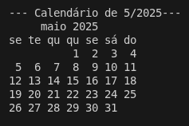

# 📅 Python Calendar Tool
Uma aplicação simples e eficiente desenvolvida em Python para visualização e gerenciamento de datas. Este projeto permite visualizar calendários mensais/anuais, basta digitar o ano e mes que deseja solicitar.

# ✨ Funcionalidades

- Visualização Mensal: Exibição clara de qualquer mês do ano.

- Navegação por Ano: Possibilidade de listar todos os dias de um ano e mês específico.

🛠 Tecnologias

- Linguagem: Python

- Bibliotecas: calendar e datetime

# Visualização

